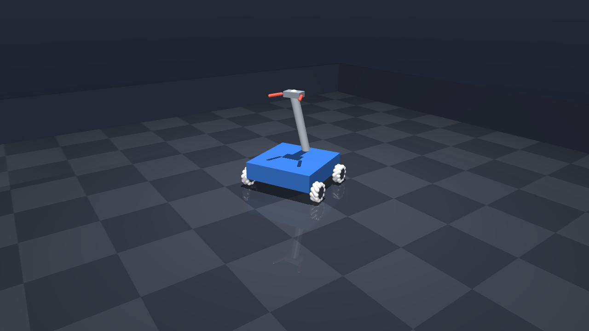

# ftcsim

A 3D physics simulator for FIRST Tech Challenge robots, built on
[MuJoCo](https://mujoco.org/). Real mecanum physics, a motor model that
respects the torque–speed curve, gamepad or keyboard teleop, and an import path
from Onshape CAD.

Built as a learning project. It is not affiliated with *FIRST* or goBILDA.



## Status

Honest state of things, so you know what you're getting:

| Feature | State |
|---|---|
| Mecanum drivetrain (40 hinged rollers) | **Working**, validated |
| Motor torque–speed model, encoders, IMU | **Working** |
| Arm with gravity-feedforward hold | **Working** |
| Keyboard teleop | **Working** |
| Gamepad teleop | **Untested** — written, never run against real hardware |
| Wheel presets + CAD wheel swapping | **Working** |
| Onshape import | **Wired up, never run** — needs your API keys |
| Claw picking up a game element | **Not working** — see Known Issues |

## Install

Requires Python 3.10+. On Windows, use WSL2 (WSLg supplies the GUI).

```bash
git clone https://github.com/YOUR_USERNAME/ftcsim.git
cd ftcsim
python3 -m venv .venv
./.venv/bin/pip install mujoco numpy pygame imageio imageio-ffmpeg pillow
```

Optional, only if you want Onshape import:

```bash
./.venv/bin/pip install onshape-to-robot
```

## Use

### Drive it

```bash
./.venv/bin/python teleop.py
```

Two windows open: the 3D view and a small control panel. **Click the control
panel** — that's what has keyboard focus.

| key | action | key | action |
|---|---|---|---|
| `W` / `S` | forward / back | `SPACE` | toggle claw |
| `A` / `D` | strafe left / right | `G` | toggle field-centric |
| `Q` / `E` | turn left / right | `BKSP` | reset |
| `R` / `F` | arm up / down | `ESC` | quit |

Plug in an Xbox-style controller before launching and it takes over.

> **Why a separate window?** MuJoCo's viewer binds every letter A–Z to a render
> flag — `W` is wireframe, `S` is shadow, `R` is reflection. A `key_callback`
> runs *in addition* to those, so driving with WASD inside the viewer also
> strobes the render settings. Owning the keyboard in our own window is the only
> clean fix. Keys typed into the 3D window still hit MuJoCo's shortcuts; that's
> the viewer's behaviour, not ours.

### Validate the drivetrain

```bash
./.venv/bin/python drive_test.py
```

```
command              dX      dY    dYaw     m/s  peak rad/s
forward            1.58   -0.02     1.1    0.79        31.8
strafe left       -0.00    1.59    -0.1    0.79        31.8
strafe right       0.01   -1.59     0.0    0.79        31.7
```

Strafing is pure sideways to within 0.1° of yaw. Peak wheel speed pins at free
speed (32.7 rad/s) instead of running away.

### Compare wheels

```bash
./.venv/bin/python compare_wheels.py
```

Measures acceleration, top speed, strafe efficiency and pushing power for each
preset. The interesting result: in free driving the robot is **motor-limited,
not traction-limited**, so roller compound barely matters. It only shows up in
a pushing match, where grip is the binding constraint.

### Record a video

```bash
./.venv/bin/python teleop_showcase.py   # scripted driving -> teleop_demo.mp4
./.venv/bin/python auto_demo.py         # scripted autonomous -> demo.mp4
```

## Wheel presets

```bash
./.venv/bin/python wheels.py     # list them
```

| key | wheel | rollers | durometer |
|---|---|---|---|
| `gobilda_96` | goBILDA 96 mm Mecanum | 10 | 70A |
| `gobilda_104` | goBILDA 104 mm GripForce | 11 | 40A |
| `soft_test` | hypothetical soft | 10 | ~30A |
| `hard_test` | hypothetical hard | 10 | ~90A |

```python
from robot import build_mjcf
xml = build_mjcf("gobilda_104")
```

Diameter, roller count and durometer for the goBILDA wheels come from published
specs. **The friction coefficients are estimates** — durometer is a hardness
rating, not a friction coefficient, and there's no clean conversion. They're
ordered correctly relative to each other, which is what matters for comparing
designs, but don't treat an absolute number as truth. Measure your real robot's
acceleration and tune `roller_friction` until the sim matches.

Fitting a bigger wheel raises the chassis, because the axle stays put — same as
on real hardware. That raises your centre of gravity.

## Importing your own robot from Onshape

Full instructions in [`onshape_import/README.md`](onshape_import/README.md).
Short version:

1. Get free API keys at <https://dev-portal.onshape.com/keys>, export
   `ONSHAPE_ACCESS_KEY` and `ONSHAPE_SECRET_KEY`.
2. In Onshape, rename the mates that should move: a Revolute mate named
   `dof_shoulder` becomes an actuated joint. Prefixes are `dof_`, `fix_`,
   `frame_`, `link_`, `closing_`.
3. **Assign a material to every part** — mass and inertia come from there.
4. Paste your assembly URL into `onshape_import/config.json`, then
   `./.venv/bin/onshape-to-robot onshape_import`.

### Then swap the wheels

CAD wheels are the one part of an import that's actively wrong: a mecanum wheel
in CAD is a rigid lump, its rollers modelled as shapes rather than bodies that
spin. Simulate that and the robot **cannot strafe at all**.

```bash
./.venv/bin/python wheel_swap.py imported.xml --list
./.venv/bin/python wheel_swap.py imported.xml --preset gobilda_104 -o robot_fixed.xml
```

Measured on a test export, before and after:

| | forward | strafe |
|---|---|---|
| raw CAD export | 2.92 m | **0.014 m** |
| after swap | 2.74 m | **−2.36 m** |

Detected wheels are replaced with generated ones whose rollers are real hinged
bodies, and the joints come out named `drive_fl` … `drive_br` so `motors.py`
works unchanged.

## How it fits together

```
robot.py       generates the MJCF model (field, chassis, arm) from Python
wheels.py      mecanum presets + the roller/wheel MJCF generator
motors.py      torque-speed motor model + an FTC-shaped robot API
teleop.py      gamepad / keyboard driving
wheel_swap.py  detect and replace CAD wheels in an imported model
```

The motor model is the part that matters most:

```python
T = T_stall * (power - omega / omega_free)
```

A real DC motor can't produce stall torque at full speed — back-EMF eats it.
MuJoCo's `motor` actuator has no such limit: ask for 3 N·m and it delivers 3 N·m
at 8000 RPM. Without this the wheels spun to 798 rad/s with zero traction and
every mechanism "worked".

## Known issues

- **The claw doesn't pick up the cube.** It closes on it and lifts briefly, but
  drops it under acceleration. `tune_grab.py` grid-searches approach poses and
  finds cells that work; making it survive the drive-away is unfinished. Likely
  needs longer fingers or more wrap — the current ones only touch flat faces.
- **Gamepad path is untested.** Written, never run against a real controller.
- **Mecanum slip is directionally right, quantitatively wrong.** Fine for
  teleop feel; don't trust it for precise autonomous.
- **No belt/chain compliance or backlash.** Sim joints are rigid; your real arm
  has slop.
- **Battery sag is a crude global scale factor**, not a real model.

## Licence

MIT
